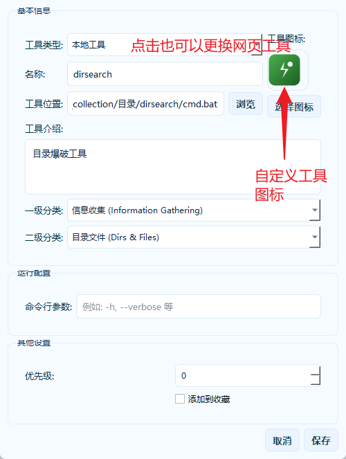
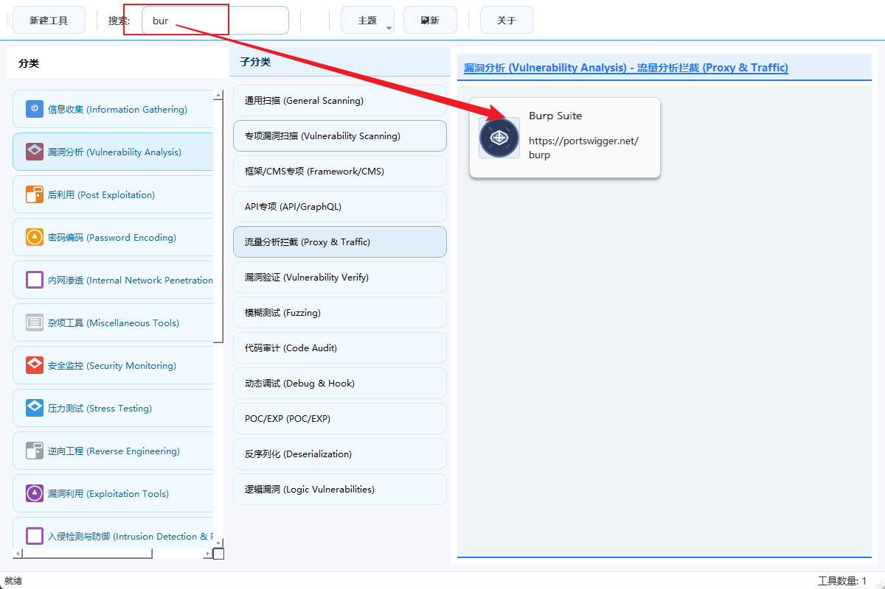

# 子非鱼工具箱 (ZifeiyuSec Toolkit)

一个现代化、功能齐全的渗透测试工具分类管理平台，专为安全测试人员设计，帮助快速组织和访问各种渗透测试工具。

## 📋 项目概述

子非鱼工具箱是一个适配于Windows平台的Web网络安全工具管理系统，提供直观的图形界面，帮助安全测试人员更高效地管理和使用各类渗透测试工具。
效果图：


可以通过鼠标右键新建分类/子分类，左上角新增工具可以自由配置工具。

当前的分类是我自定义分类的，可以删除自己定义分类，添加工具

图中工具仅仅示例，所有的工具都需要自己配置添加。

## 使用指南

### 添加工具

以我的dirsearch工具添加为例，演示添加工具



因为dirsearch是命令行工具，我是在dirsearch目录下创建txt文件，里面写入cmd.exe，然后重命名文件名为cmd.bat来添加的，

添加后就可以点击卡片运行了，可以鼠标右键编辑/删除工具，收藏功能待完善。

当工具多的时候可以直接搜索工具



## 主题

目前有两套主题，蓝白风格和墨绿风格

蓝白风格如上图，墨绿风格如下图：


功能点简单，后续可能继续完善增加其他功能，

## 📦 安装说明

### 从源代码安装

1. **克隆仓库**
```bash
git clone https://github.com/zifeiyu-sec/zifeiyuSec-Toolkit.git
cd zifeiyuSec-Toolkit
```

2. **安装依赖**

   方法一：使用requirements.txt安装所有依赖
   ```bash
   pip install -r requirements.txt
   ```

   方法二：手动安装主要依赖
   ```bash
   pip install PyQt5>=5.15.0
   ```

3. **运行应用**
```bash
python main.py
```

### 从可执行文件安装

1. **下载可执行文件**
   - 从GitHub仓库的dist目录下载ZifeiyuSec.exe
   - 或者直接克隆仓库后从`zifeiyuSec-Toolkit/dist`目录获取

2. **创建配置目录**
   - 在可执行文件所在目录创建`data`文件夹
   - 从源码中复制`categories.json`和`tools.json`到data目录

3. **运行应用**
   - 双击ZifeiyuSec.exe即可启动应用

### 打包为可执行文件（开发者）

如果您想自己打包应用：

1. **安装PyInstaller**
```bash
pip install PyInstaller>=6.0.0
```

2. **运行打包脚本**
```bash
python build_exe.py
```

3. **获取打包结果**
   - 可执行文件将生成在`dist`目录下
   - 同时会自动创建`dist/data`目录用于存放配置文件


## 交流

扫码添微入群，不止工具相磋，更有技术共研、闲叙吃瓜；方寸群聊间，既藏攻防干货，亦容烟火日常，盼与君共赴这场技术与烟火交织的相聚。


## 📌 注意事项

1. 本工具仅供合法的渗透测试和安全评估使用
2. 使用本工具进行任何未授权的测试均属非法行为
3. 作者对使用本工具造成的任何后果不承担责任
4. 请在使用前遵守当地法律法规

