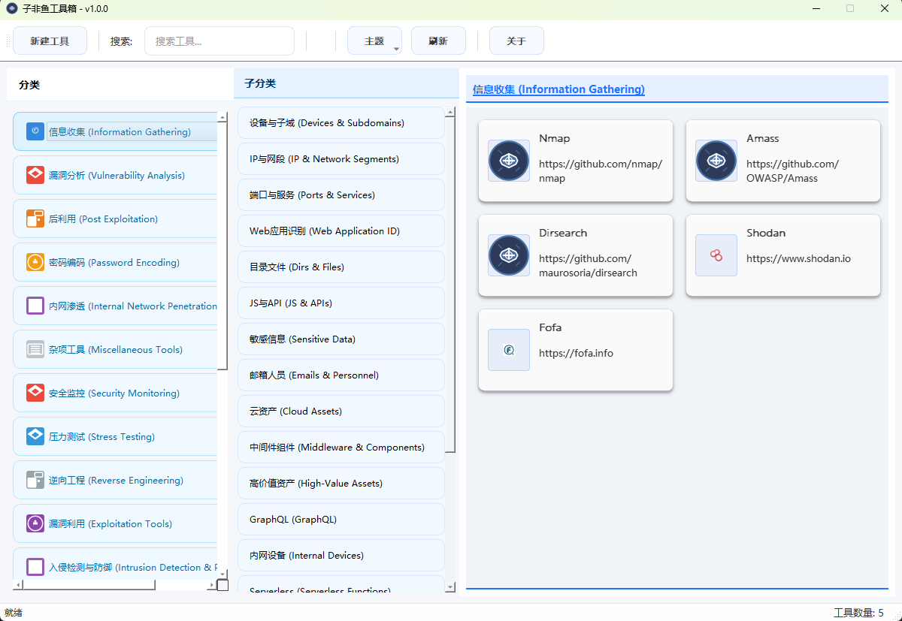
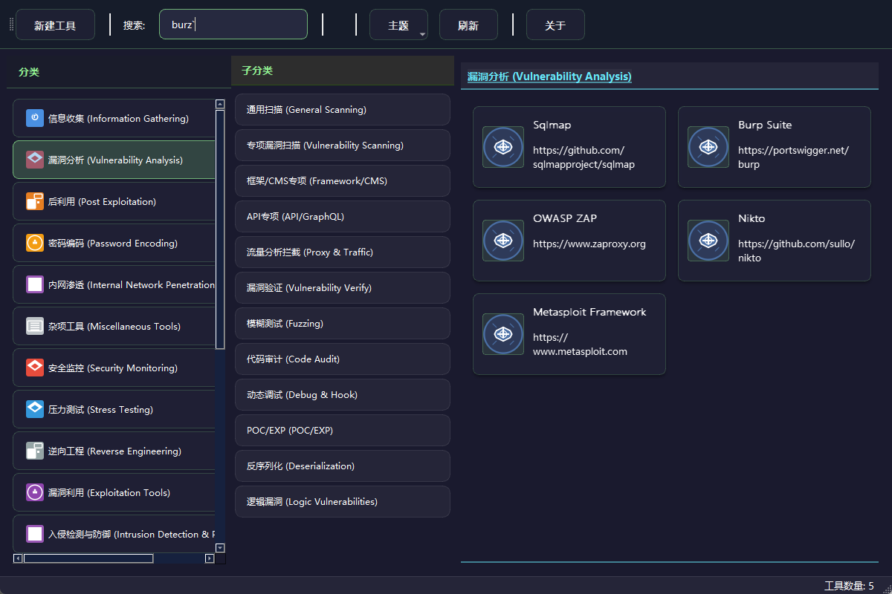

# 子非鱼工具箱 (ZifeiyuSec Toolkit)

一个现代化、功能齐全的渗透测试工具分类管理平台，专为安全测试人员设计，帮助快速组织和访问各种渗透测试工具。

## 📋 项目简介

子非鱼工具箱是一个基于PyQt5开发的Web网络安全工具管理系统，提供直观的图形界面，帮助安全测试人员更高效地管理和使用各类渗透测试工具。

### 核心优势

- **直观的图形界面**：现代化的UI设计，支持主题切换
- **灵活的工具管理**：支持添加、编辑、删除和搜索工具
- **分类管理系统**：支持多级分类，便于工具组织
- **自定义配置**：支持工具参数配置和工作目录设置
- **支持多种工具类型**：命令行工具和网页工具
- **使用统计**：自动记录工具使用次数和最后使用时间
- **隐藏终端运行**：支持通过VBS/BAT脚本隐藏终端窗口运行工具

## 🚀 主要功能

### 1. 工具管理

- ✅ 添加新工具（支持命令行工具和网页工具）
- ✅ 编辑工具配置
- ✅ 删除工具
- ✅ 收藏常用工具
- ✅ 工具使用统计
- ✅ 工具搜索功能

### 2. 分类管理

- ✅ 添加一级分类
- ✅ 添加二级子分类
- ✅ 编辑分类信息
- ✅ 删除分类
- ✅ 分类图标自定义

### 3. 主题支持

- ✅ 蓝白主题
- ✅ 墨绿主题
- ✅ 主题切换功能

### 4. 配置管理

- ✅ JSON配置文件
- ✅ 图形界面配置
- ✅ 手动编辑配置文件
- ✅ 配置文件备份与恢复

### 5. 运行方式

- ✅ 直接运行Python脚本
- ✅ 打包为可执行文件
- ✅ 隐藏终端窗口运行

## 📸 效果图

### 蓝白主题



### 墨绿主题



## 🛠️ 快速开始

### 从源代码运行

1. **克隆仓库**
```bash
git clone https://github.com/zifeiyu-sec/zifeiyuSec-Toolkit.git
cd zifeiyuSec-Toolkit
```

2. **安装依赖**
```bash
pip install -r requirements.txt
```

3. **运行应用**
```bash
python main.py
```

### 从可执行文件运行

1. **下载可执行文件**
   - 从GitHub仓库的dist目录下载ZifeiyuSec.exe
   - 或者直接克隆仓库后从`zifeiyuSec-Toolkit/dist`目录获取

2. **创建配置目录**
   - 在可执行文件所在目录创建`data`文件夹
   - 从源码中复制`categories.json`和`tools.json`到data目录

3. **运行应用**
   - 双击ZifeiyuSec.exe即可启动应用
   - 或使用提供的`run_tool.vbs`脚本隐藏终端窗口运行

## 📖 详细使用指南

### 1. 添加工具

#### 命令行工具添加示例

以dirsearch工具为例：

1. 点击左上角"新增工具"按钮
2. 填写工具基本信息：
   - 工具名称：dirsearch
   - 工具路径：选择dirsearch目录下的cmd.bat文件
   - 描述：目录扫描工具
   - 分类：选择合适的分类和子分类
   - 标签：端口扫描,目录扫描
3. 配置运行参数：
   - 命令行参数：可根据需要添加
   - 工作目录：设置为工具所在目录
   - 勾选"在终端中运行"
4. 点击"保存"完成添加

#### 网页工具添加示例

1. 点击左上角"新增工具"按钮
2. 填写工具基本信息：
   - 工具名称：Google搜索
   - 工具路径：https://www.google.com
   - 描述：搜索引擎
   - 分类：选择合适的分类
   - 标签：搜索,网页
3. 勾选"网页工具"
4. 点击"保存"完成添加

### 2. 编辑工具

1. 右键点击工具卡片
2. 选择"编辑工具"
3. 修改工具信息
4. 点击"保存"完成修改

### 3. 删除工具

1. 右键点击工具卡片
2. 选择"删除工具"
3. 确认删除

### 4. 搜索工具

1. 在搜索框中输入工具名称或标签
2. 系统会实时过滤显示匹配的工具

### 5. 管理分类

#### 添加分类

1. 右键点击左侧分类区域
2. 选择"添加分类"
3. 填写分类名称和选择图标
4. 点击"保存"完成添加

#### 添加子分类

1. 右键点击要添加子分类的父分类
2. 选择"添加子分类"
3. 填写子分类名称
4. 点击"保存"完成添加

#### 编辑分类

1. 右键点击要编辑的分类
2. 选择"编辑分类"
3. 修改分类信息
4. 点击"保存"完成修改

#### 删除分类

1. 右键点击要删除的分类
2. 选择"删除分类"
3. 确认删除

## ⚙️ 配置管理

### 配置文件概述

子非鱼工具箱使用JSON格式的配置文件来存储工具分类和工具信息，这些配置文件位于`data`目录下：

- `categories.json`：存储工具的分类结构
- `tools.json`：存储所有工具的详细信息

### 配置文件结构

#### categories.json

```json
{
  "categories": [
    {
      "name": "信息收集 (Information Gathering)",
      "icon": "info_gather.svg",
      "id": 1,
      "subcategories": [
        {
          "name": "设备与子域 (Devices & Subdomains)",
          "id": 101,
          "parent_id": 1
        }
      ]
    }
  ]
}
```

#### tools.json

```json
[
  {
    "id": 1,
    "name": "Nmap",
    "path": "C:\\",
    "description": "https://github.com/nmap/nmap",
    "category_id": 1,
    "subcategory_id": 103,
    "background_image": "",
    "icon": "new_default_icon.svg",
    "tags": ["端口扫描", "网络发现"],
    "priority": 0,
    "is_favorite": true,
    "arguments": "",
    "working_directory": "C:\\",
    "run_in_terminal": true,
    "is_web_tool": false,
    "usage_count": 14,
    "last_used": "2025-11-30T21:22:53.705972Z"
  }
]
```

### 配置文件字段说明

#### categories.json字段

| 字段名 | 类型 | 描述 |
|--------|------|------|
| name | string | 分类名称 |
| icon | string | 分类图标（位于`resources/icons/`目录下） |
| id | integer | 分类唯一标识符 |
| subcategories | array | 子分类列表 |
| subcategories.name | string | 子分类名称 |
| subcategories.id | integer | 子分类唯一标识符 |
| subcategories.parent_id | integer | 父分类ID |

#### tools.json字段

| 字段名 | 类型 | 描述 |
|--------|------|------|
| id | integer | 工具唯一标识符 |
| name | string | 工具名称 |
| path | string | 工具路径或URL |
| description | string | 工具描述 |
| category_id | integer | 所属一级分类ID |
| subcategory_id | integer | 所属二级分类ID |
| background_image | string | 工具卡片背景图片 |
| icon | string | 工具图标 |
| tags | array | 工具标签 |
| priority | integer | 工具优先级 |
| is_favorite | boolean | 是否收藏 |
| arguments | string | 命令行参数 |
| working_directory | string | 工作目录 |
| run_in_terminal | boolean | 是否在终端中运行 |
| is_web_tool | boolean | 是否为网页工具 |
| usage_count | integer | 使用次数 |
| last_used | string | 最后使用时间（ISO格式） |

## 🎨 主题切换

子非鱼工具箱支持两种主题：

1. **蓝白主题**：清爽的蓝白配色方案
2. **墨绿主题**：沉稳的墨绿配色方案

### 切换主题

1. 点击右上角的设置按钮
2. 选择"主题设置"
3. 在主题列表中选择喜欢的主题
4. 主题将立即切换

## 📦 安装方法

### 方法一：从源代码安装

#### 1. 克隆仓库

```bash
git clone https://github.com/zifeiyu-sec/zifeiyuSec-Toolkit.git
cd zifeiyuSec-Toolkit
```

#### 2. 安装依赖

**使用requirements.txt安装所有依赖：**

```bash
pip install -r requirements.txt
```

**手动安装主要依赖：**

```bash
pip install PyQt5>=5.15.0
```

#### 3. 运行应用

```bash
python main.py
```

### 方法二：从可执行文件安装

#### 1. 下载可执行文件

- 从GitHub仓库的dist目录下载ZifeiyuSec.exe
- 或者直接克隆仓库后从`zifeiyuSec-Toolkit/dist`目录获取

#### 2. 准备配置文件

- 在可执行文件所在目录创建`data`文件夹
- 从源码中复制`categories.json`和`tools.json`到data目录

#### 3. 运行应用

- **方法1**：直接双击ZifeiyuSec.exe启动
- **方法2**：使用提供的`run_tool.vbs`脚本隐藏终端窗口运行
- **方法3**：使用提供的`run_tool.bat`脚本运行

### 方法三：打包为可执行文件（开发者）

如果您想自己打包应用：

#### 1. 安装PyInstaller

```bash
pip install PyInstaller>=6.0.0
```

#### 2. 运行打包脚本

```bash
python build_exe.py
```

#### 3. 获取打包结果

- 可执行文件将生成在`dist`目录下
- 同时会自动创建`dist/data`目录用于存放配置文件

## 🛠️ 开发指南

### 项目结构

```
zifeiyuSec-Toolkit/
├── core/                 # 核心功能模块
│   ├── app.py           # 应用主逻辑
│   ├── data_manager.py  # 数据管理
│   └── image_manager.py # 图片管理
├── ui/                   # UI组件
│   ├── category_view.py     # 分类视图
│   ├── subcategory_view.py  # 子分类视图
│   ├── tool_card.py         # 工具卡片
│   ├── tool_config_dialog.py # 工具配置对话框
│   └── image_selector.py    # 图片选择器
├── resources/            # 资源文件
│   ├── icons/           # 图标资源
│   └── styles/          # 样式文件
├── data/                 # 配置文件
│   ├── categories.json  # 分类配置
│   └── tools.json       # 工具配置
├── images/               # 图片资源
│   └── README/          # README文档图片
├── main.py               # 应用入口
├── build_exe.py          # 打包脚本
├── requirements.txt      # 依赖列表
├── run_tool.vbs          # VBS启动脚本（隐藏终端）
├── run_tool.bat          # BAT启动脚本
├── .gitignore           # Git忽略文件
└── README.md            # 项目文档
```

### 代码质量

项目使用pylint进行代码质量检查：

```bash
pylint main.py core/ ui/
```

### 开发规范

1. **导入顺序**：标准库 → 第三方库 → 本地模块
2. **代码格式**：遵循PEP 8规范
3. **文档字符串**：为所有类和方法添加文档字符串
4. **命名规范**：
   - 类名：大驼峰命名法（如ToolCard）
   - 方法名：小驼峰命名法（如on_add_tool）
   - 变量名：下划线分隔命名法（如tool_list）
5. **注释**：关键代码添加注释说明

## 🤝 贡献指南

欢迎提交Issue和Pull Request！

### 提交Pull Request流程

1. Fork本仓库
2. 创建特性分支：`git checkout -b feature/AmazingFeature`
3. 提交更改：`git commit -m 'Add some AmazingFeature'`
4. 推送到分支：`git push origin feature/AmazingFeature`
5. 打开Pull Request

## 📄 许可证

本项目采用MIT许可证 - 查看[LICENSE](LICENSE)文件了解详情

## ⚠️ 免责声明

1. 本工具仅供合法的渗透测试和安全评估使用
2. 使用本工具进行任何未授权的测试均属非法行为
3. 作者对使用本工具造成的任何后果不承担责任
4. 请在使用前遵守当地法律法规

## 📞 交流

扫码添微入群，不止工具相磋，更有技术共研、闲叙吃瓜；方寸群聊间，既藏攻防干货，亦容烟火日常，盼与君共赴这场技术与烟火交织的相聚。


---

**致每一位坚守攻防一线的红队蓝队战友：**

愿你的探针精准破局，盾牌坚不可摧；愿漏洞皆可预判，风险尽在掌控。以技术为刃，以安全为盾，在数字疆域护万家无虞，祝前路披荆斩棘，攻防皆胜，平安顺遂！

---

**项目地址：** [https://github.com/zifeiyu-sec/zifeiyuSec-Toolkit](https://github.com/zifeiyu-sec/zifeiyuSec-Toolkit)

**版本：** v1.0.0
**更新时间：** 2025-11-30