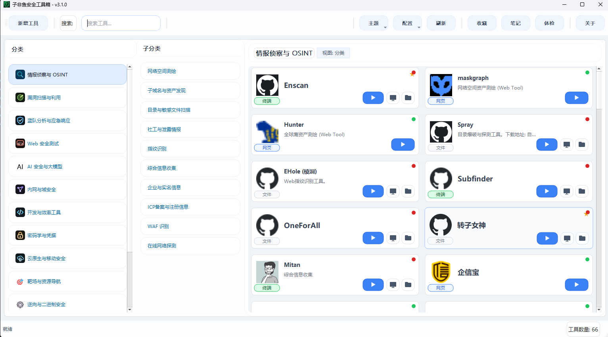

# 子非鱼安全工具箱

一个面向 Windows 安全工作流的桌面工具箱，用来统一管理本地安全工具、脚本入口、目录入口、Web 平台和工具笔记。

项目基于 PyQt5，适合长期维护个人或团队常用工具清单，减少“工具散落在各个目录、参数不好记、笔记难沉淀”的问题。



## 系统要求

- Windows 10 / 11
- Python 3.10 及以上

> 当前项目定位为 Windows 桌面工具箱，未针对 macOS / Linux 做完整适配说明。

## 快速开始

### 1. 安装依赖

```powershell
git clone https://github.com/zifeiyu-sec/zifeiyuSec-Toolkit.git
cd zifeiyuSec-Toolkit
pip install -r requirements.txt
```

### 2. 启动程序

```powershell
python main.py
```

### 3. 首次运行说明

程序首次启动时会自动初始化运行目录，用于存放用户自己的配置、运行数据和笔记内容。

常见运行时数据包括：

- `.runtime/settings.ini`
- `.runtime/data/tools.json`
- `.runtime/resources/notes/`
- `.runtime/resources/notes/_attachments/`
- `.runtime/images/`
- `.runtime/updates/`

## 开发说明

在学习网络安全的过程中，我不断接触到各种各样的新工具。随着工具数量越来越多，如何高效整理、分类和使用它们，逐渐成了一个实际问题。

后来我接触到了天狐工具箱，整体使用体验很不错，也给了我不少启发。作为一名仍在不断学习中的网络安全新人，我也希望能打造一款更符合自己使用习惯的工具箱，本来编程能力不足，但随着AI的发展，我的想法得以落地，于是就有了这个项目。现在将它开源出来，希望能给同样有类似需求的朋友提供一种新的选择。

目前，工具箱中已经预置和整理了一批我自己常用的工具配置。其中，网页类工具可以开箱即用，直接打开；本地工具则需要使用者根据自己的环境逐步配置。部分工具项已经预先建立好了，只需要把路径修改为你本机对应的工具路径即可使用。

对于像 `dirsearch`、`sqlmap` 这类常见命令行工具，我通常会通过一个简单的 `cmd` 或 `PowerShell` 启动器来接入工具箱。例如，在工具所在目录中执行类似 `echo "cmd.exe">cmd.bat` 这样的方式生成一个启动入口，再将它配置为工具路径，就可以实现一键启动。你也可以按照自己的习惯，用其他方式接入本地命令行工具。

当前工具箱在图标自动处理方面还不算特别理想，因此我已经预先配置了一部分图标，方便直接使用。当然，使用者也可以根据自己的喜好继续补充和调整图标配置。

现有的一、二级分类，主要基于我个人的使用习惯，并结合 AI 辅助整理完成。它不一定是唯一合理的分类方式，因此用户完全可以根据自己的工作流，创建更适合自己的分类体系。同时，工具箱也支持导入天狐 2.0 版本的工具配置。至于其他版本，目前暂未适配，主要是因为我自己实际使用的是天狐 2.0。

这个项目会持续更新和维护。后续我也会不断加入一些自己实际使用体验不错的工具和配置，希望它能逐渐变得更实用、更顺手，也希望每一位使用它的人都能用得舒服。

## 常见使用流程

### 添加工具

在“新增工具”中可以添加：

- 本地工具：例如 `.exe`、脚本、批处理等
- 本地目录：作为目录入口使用
- 网页工具：填写 `http://` 或 `https://` 地址

可配置字段包括：

- 名称
- 路径 / URL
- 描述
- 一级分类 / 二级分类
- 是否收藏
- 运行命令 / 参数
- 工作目录
- 是否在终端中运行
- 自定义类型标签
- 工具图标

### 启动工具

程序会根据工具类型自动选择启动方式：

- Web 工具：浏览器打开
- 本地目录：系统文件管理器打开
- 本地文件：按配置直接启动
- 终端工具：在终端中按参数执行

### 搜索与收藏

- 顶部搜索框可快速检索工具
- 收藏页适合放常用工具
- 搜索不仅匹配名称和描述，也会命中笔记内容

### 使用笔记

- 每个工具都可以绑定一份独立 Markdown 笔记
- 适合记录参数、排错过程、命令示例和使用心得
- 支持附件复制，便于保存截图和相关文件

### 配置菜单

顶部“配置”菜单提供以下能力：

- 导入本地工具配置
- 导出当前配置
- 导入天狐 2.0 配置
- 删除天狐导入工具
- 同步官方工具库
- 检查更新
- 一键更新

## 桌面快捷方式

如果你希望从桌面直接启动：

```powershell
python scripts/create_desktop_shortcut.py
```

脚本会在当前用户桌面创建快捷方式，优先使用可用的 `pythonw.exe` 启动主程序。

仓库根目录同时提供了 [run_tool.vbs](run_tool.vbs) 作为备用启动方式。

## 配置文件示例

项目提供了 [settings.example.ini](settings.example.ini) 作为示例配置，包含：

- 默认主题
- 官方工具库同步地址
- GitHub 更新源配置
- 启动时是否自动检查更新

如需预设这些值，可复制一份为 `settings.ini` 后再启动。

## 项目结构

```text
core/        核心逻辑
ui/          界面与交互组件
data/        预置工具与分类数据
docs/        项目文档
resources/   图标、默认资源与笔记模板资源
scripts/     辅助脚本
tests/       测试代码
```

## 文档

- [用户指南](docs/USER_GUIDE.md)
- [配置与数据说明](docs/CONFIG_AND_DATA.md)
- [发布检查清单](docs/RELEASE_CHECKLIST.md)

## 适合哪类用户

这个项目更适合：

- 想把本地安全工具集中管理的人
- 希望保留分类、搜索、收藏、笔记能力的人
- 既使用本地工具，也会混合使用在线平台的人
- 想发布一套预配置工具目录给团队或朋友的人

# 开发者说明

如果你在使用过程中有想法、建议，或者也对网络安全工具整理、工作流优化这类内容感兴趣，欢迎添加我的微信一起交流。

我也希望借这个项目认识更多正在学习网络安全、正在积累自己工具体系的朋友。后续如果人数合适，也会拉一个交流群，方便大家一起讨论工具使用、配置思路、分类方式以及学习过程中遇到的问题，互相交流、共同进步。

无论你是刚入门，还是已经有自己的使用习惯，都欢迎来交流。希望这个工具箱不仅仅是一个项目，也能成为大家一起学习和分享的一个小入口。


## 免责声明

本项目仅用于合法授权的安全研究、学习、演练和本地工具管理。请在遵守法律法规、组织规范和授权边界的前提下使用。
