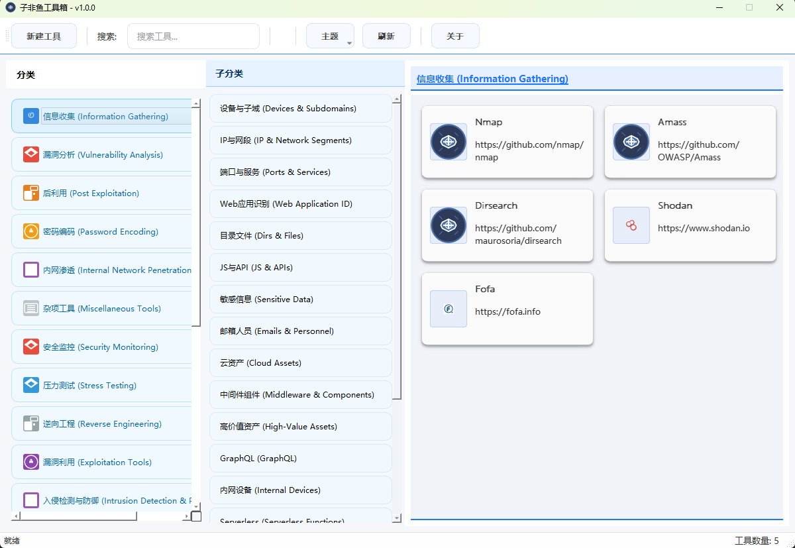
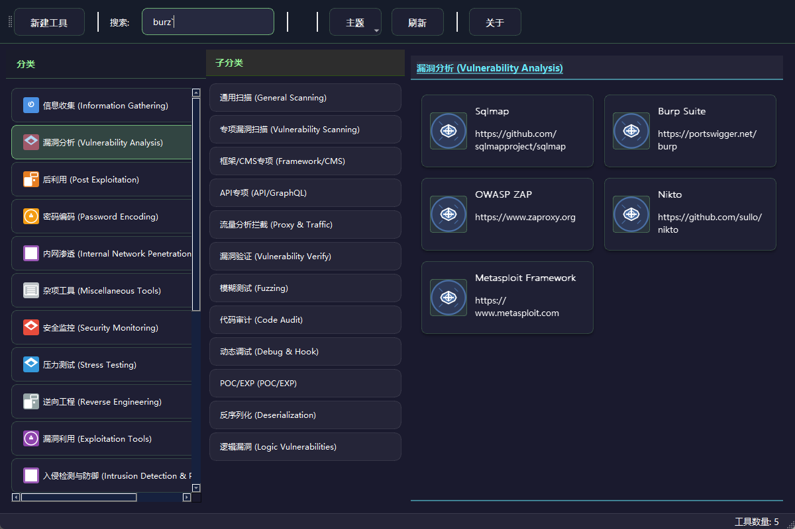

# 子非鱼工具箱 (ZifeiyuSec Toolkit) v2.0.0

一个现代化、功能齐全的红蓝攻防工具分类管理平台，专为安全测试人员设计，帮助快速组织和访问各种渗透测试工具。

## 📋 项目简介

子非鱼工具箱是一个基于PyQt5开发的Web网络安全工具管理系统，提供直观的图形界面，帮助安全测试人员更高效地管理和使用各类渗透测试工具。

### 核心优势

- **直观的图形界面**：现代化的UI设计，支持主题切换
- **灵活的工具管理**：支持添加、编辑、删除和搜索工具
- **分类管理**：支持一级分类和二级分类的管理
- **自定义配置**：支持工具参数配置和工作目录设置
- **智能工具运行**：自动检测工具类型，支持在终端中运行命令行工具
- **支持多种工具类型**：命令行工具和网页工具
- **使用统计**：自动记录工具使用次数和最后使用时间
- **工具收藏**：快速访问常用工具
- **隐藏终端运行**：支持通过VBS/BAT脚本隐藏终端窗口运行
- **快速启动方式**：支持创建桌面快捷方式，双击启动无终端显示
- **Markdown笔记**：为每个工具添加详细的使用笔记

## 🚀 快速开始

### 环境要求

- Python 3.8+
- PyQt5及相关依赖

### 使用方式

#### 方式1：直接运行（有Python环境）

1. **克隆仓库**
```bash
git clone https://github.com/zifeiyu-sec/zifeiyuSec-Toolkit.git
cd zifeiyuSec-Toolkit
```

2. **安装依赖**
```bash
pip install -r requirements.txt
```

3. **运行应用**
```bash
python main.py
```

#### 方式2：创建桌面快捷方式（双击启动）

1. **克隆仓库**
```bash
git clone https://github.com/zifeiyu-sec/zifeiyuSec-Toolkit.git
cd zifeiyuSec-Toolkit
```

2. **安装依赖**
```bash
pip install -r requirements.txt
```

3. **创建快捷方式**
```bash
python scripts/create_desktop_shortcut.py
```

4. **使用快捷方式**
   - 在桌面上找到名为"子非鱼工具箱.lnk"的快捷方式
   - 双击即可启动应用
   - 启动时无终端窗口显示
   - 图标使用`image.ico`

## 📋 主要功能

### 工具管理
- ✅ 添加新工具（命令行工具和网页工具）
- ✅ 编辑工具配置
- ✅ 删除工具
- ✅ 收藏常用工具
- ✅ 工具使用统计
- ✅ 工具搜索功能
- ✅ 智能终端执行：自动检测工具类型，决定是否在终端中运行
- ✅ 自定义参数配置：支持为工具配置命令行参数
- ✅ Markdown笔记：为每个工具添加详细的使用笔记

### 分类管理
- ✅ 多级分类支持
- ✅ 分类编辑和删除
- ✅ 分类管理界面

### 主题支持
- ✅ 蓝白主题
- ✅ 墨绿主题
- ✅ 主题切换功能

## 📸 效果图

### 蓝白主题



### 墨绿主题



## 📖 使用指南

### 添加工具

1. 点击左上角"新建工具"按钮
2. 填写工具基本信息（名称、路径、描述等）
3. 选择分类和子分类
4. 配置运行参数（可选）
5. 点击"保存"完成添加

### 编辑工具

1. 右键点击工具卡片
2. 选择"编辑工具"
3. 修改工具信息
4. 点击"保存"完成修改

### 搜索工具

1. 在搜索框中输入工具名称或标签
2. 系统会实时过滤显示匹配的工具
3. 支持模糊搜索和相似度匹配

### 切换主题

1. 点击右上角的主题按钮
2. 在主题列表中选择喜欢的主题
3. 主题将立即切换

### 工具运行

1. 点击工具卡片即可运行工具
2. 系统会根据工具类型自动决定运行方式
3. 命令行工具会在终端中运行
4. 网页工具会在浏览器中打开

### Markdown笔记

1. 右键点击工具卡片
2. 选择"打开笔记"
3. 在弹出的对话框中编辑Markdown笔记
4. 笔记会自动保存到`resources/notes/`目录

## 🛠️ 项目结构

```
zifeiyuSec-Toolkit/
├── core/                 # 核心功能模块
│   ├── app.py           # 应用外观
│   ├── data_manager.py  # 数据管理
│   ├── image_manager.py # 图片管理
│   ├── logger.py        # 日志管理
│   ├── notes_manager.py # 笔记管理
│   └── style_manager.py # 样式管理
├── ui/                   # UI组件
│   ├── category_view.py     # 分类视图
│   ├── subcategory_view.py  # 子分类视图
│   ├── tool_model_view.py   # 工具卡片容器
│   ├── tool_config_dialog.py # 工具配置对话框
│   ├── image_selector.py    # 图片选择器
│   └── markdown_note_dialog.py # Markdown笔记对话框
├── resources/            # 资源文件
│   ├── icons/           # 图标资源
│   └── notes/           # Markdown笔记
├── data/                 # 配置文件
│   ├── categories.json  # 分类配置
│   └── tools.json       # 工具配置
├── images/               # 图片资源
├── scripts/              # 辅助脚本
│   ├── create_desktop_shortcut.py  # 快捷方式创建脚本
│   └── process_probe.py            # 进程探测脚本
├── main.py               # 应用入口
├── requirements.txt      # 依赖列表
├── run_tool.vbs          # VBS启动脚本（隐藏终端）
├── image.ico             # 应用图标
├── image.png             # 应用图标（PNG格式）
└── README.md            # 项目文档
```

## ⚙️ 配置管理

### 配置文件概述

子非鱼工具箱使用JSON格式的配置文件来存储工具分类和工具信息，这些配置文件位于data目录下：

- categories.json：存储工具的分类结构
- tools.json：存储所有工具的详细信息

### 配置文件结构

#### categories.json

```json
[
  {
    "id": 1,
    "name": "信息收集",
    "icon": "🔍",
    "subcategories": [
      {
        "id": 101,
        "name": "子域名枚举",
        "parent_id": 1
      }
    ]
  }
]
```

#### tools.json

```json
[
  {
    "id": 1,
    "name": "Nmap",
    "path": "C:\\",
    "description": "网络扫描工具",
    "category_id": 1,
    "subcategory_id": 101,
    "background_image": "",
    "icon": "new_default_icon.ico",
    "tags": ["端口扫描", "网络发现"],
    "is_favorite": true,
    "arguments": "",
    "working_directory": "C:\\",
    "run_in_terminal": true,
    "is_web_tool": false,
    "usage_count": 14,
    "last_used": "2025-11-30T21:22:53.705972Z"
  }
]
```

### 配置文件字段说明

#### categories.json字段

| 字段名                     | 类型      | 描述                          |
|-------------------------|---------|------------------------------|
| name                    | string  | 分类名称                        |
| icon                    | string  | 分类图标（位于resources/icons/目录下或emoji） |
| id                      | integer | 分类唯一标识符                    |
| subcategories           | array   | 子分类列表                       |
| subcategories.name      | string  | 子分类名称                       |
| subcategories.id        | integer | 子分类唯一标识符                    |
| subcategories.parent_id | integer | 父分类ID                       |

#### tools.json字段

| 字段名               | 类型      | 描述           |
|-------------------|---------|--------------|
| id                | integer | 工具唯一标识符      |
| name              | string  | 工具名称         |
| path              | string  | 工具路径或URL     |
| description       | string  | 工具描述         |
| category_id       | integer | 所属一级分类ID     |
| subcategory_id    | integer | 所属二级分类ID     |
| background_image  | string  | 工具卡片背景图片     |
| icon              | string  | 工具图标         |
| tags              | array   | 工具标签         |
| is_favorite       | boolean | 是否收藏         |
| arguments         | string  | 命令行参数        |
| working_directory | string  | 工作目录         |
| run_in_terminal   | boolean | 是否在终端中运行     |
| is_web_tool       | boolean | 是否为网页工具      |
| usage_count       | integer | 使用次数         |
| last_used         | string  | 最后使用时间（ISO格式）|

## 📌 工具配置说明

1. **本地工具路径**：当前README中所有本地工具路径均使用`C:\`作为占位符，您需要根据自己的实际安装路径进行配置

2. **图标配置**：
   - 工具图标可以自行下载
   - 图标文件需放置在`resources/icons/`目录下
   - 可在工具配置界面中修改图标

3. **工具优化**：
   - 支持自动检测Windows可执行文件是否为命令行界面(CUI)应用程序
   - 对于命令行工具，会自动在终端中运行
   - 对于GUI工具，会直接运行

## ⚠️ 免责声明

1. 本工具仅供合法的渗透测试和安全评估使用
2. 使用本工具进行任何未授权的测试均属非法行为
3. 作者对使用本工具造成的任何后果不承担责任
4. 请在使用前遵守当地法律法规

## 📄 许可证

本项目采用MIT许可证 - 查看[LICENSE](LICENSE)文件了解详情

## 🤝 贡献指南

欢迎提交Issue和Pull Request！

## 📝 笔记功能（Markdown Notes）

为了方便记录每个工具的常用用法、命令示例和问题解决方案，项目内嵌了一个轻量级的 Markdown 笔记功能：

- 打开方式：在工具列表中对某个工具右键，选择 `打开笔记`。会弹出一个笔记对话框，左侧为 Markdown 编辑器，右侧为渲染预览。
- 预览模式：对话框提供 `只看预览` 切换按钮，开启后只显示右侧渲染视图（适合阅读）；再次切回可继续编辑。
- 保存位置：笔记以 Markdown 文件的形式保存在仓库根目录下的 `resources/notes/` 目录中，文件名由工具名生成并做安全化处理（非法字符替换为下划线）。
  - 例如，工具 `Nmap` 的笔记文件为 `resources/notes/Nmap.md`。
- 编码与容错：笔记以 `UTF-8` 编码保存；读取失败时会以容错模式回退读取。
- 渲染依赖：可选安装 `markdown`（已在 `requirements.txt` 中声明），若未安装将以纯文本回退显示预览。

实现细节：
- 代码位置：
  - 笔记管理：`core/notes_manager.py`（读取/保存、文件名安全化）
  - 笔记对话框：`ui/markdown_note_dialog.py`（编辑 + 预览 + 只看预览切换）
  - 右键菜单集成：`ui/tool_model_view.py`（添加了"打开笔记"动作）
- 笔记会在首次保存时自动创建 `resources/notes/` 目录（若不存在）。

## 📞 交流

扫码添微入群，不止工具相磋，更有技术共研、闲叙吃瓜；方寸群聊间，既藏攻防干货，亦容烟火日常，盼与君共赴这场技术与烟火交织的相聚。


---

**致每一位坚守攻防一线的红队蓝队战友：**

愿你的探针精准破局，盾牌坚不可摧；愿漏洞皆可预判，风险尽在掌控。以技术为刃，以安全为盾，在数字疆域护万家无虞，祝前路披荆斩棘，攻防皆胜，平安顺遂！

---

**项目地址：** [https://github.com/zifeiyu-sec/zifeiyuSec-Toolkit](https://github.com/zifeiyu-sec/zifeiyuSec-Toolkit)

**版本：** v2.0.0
**更新时间：** 2026-03-03