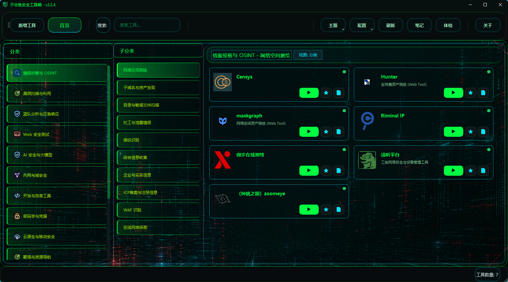
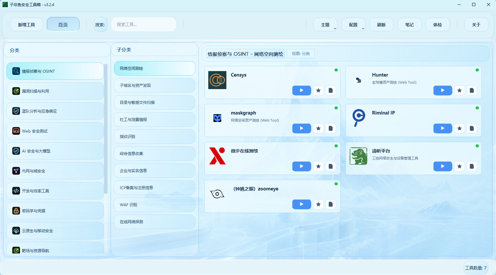
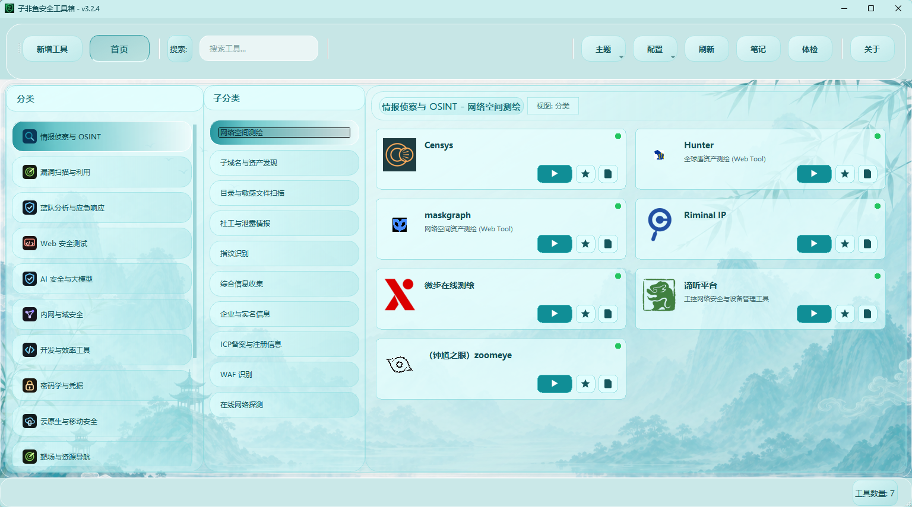
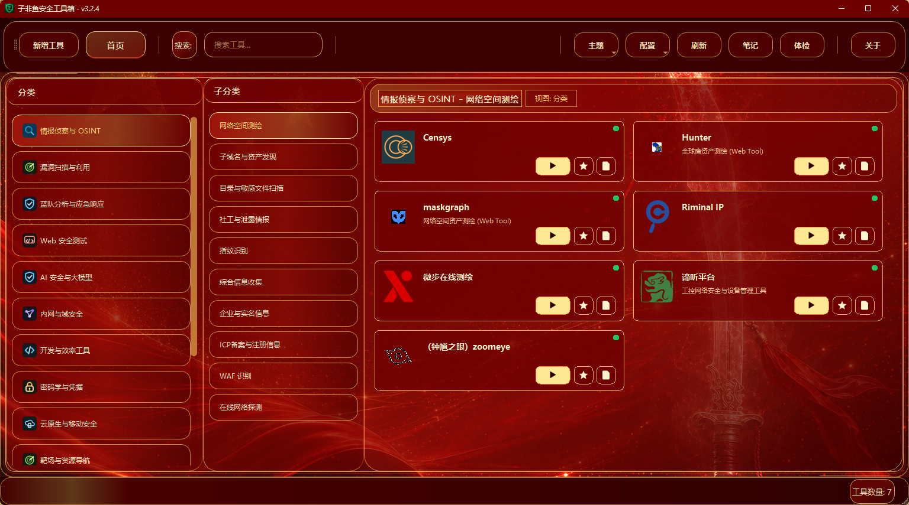

# 子非鱼安全工具箱

当前版本：`v3.2.4`

子非鱼安全工具箱是一款面向 Windows 安全工作流的桌面工具箱，用于统一管理本地安全工具、脚本入口、目录入口、Web 平台、收藏和工具笔记。

项目基于 Python + PyQt5 开发，目标是保持轻量、快速启动和便捷使用，帮助个人或团队把分散在不同目录、不同网页和不同笔记里的工具入口整理到一个稳定的工作台里。



其他主题








> 本项目仅用于合法授权的安全研究、学习、演练和本地工具管理。请在遵守法律法规、组织规范和授权边界的前提下使用。

## 主要功能

- 工具集中管理：支持本地程序、脚本、目录、文档和 Web 工具。
- 分类浏览：支持一级分类和二级分类。
- 快速启动：按工具类型自动选择浏览器、文件管理器、终端或系统默认方式打开。
- 收藏工具：将高频工具集中到收藏页。
- 工具笔记：每个工具可绑定独立 Markdown 笔记，支持搜索和附件归档。
- 全局搜索：支持搜索工具名称、描述和工具笔记内容。
- 主题界面：内置多套主题与背景资源。
- 配置导入导出：支持本地配置导入导出，也支持导入天狐 2.0 工具配置。
- 数据体检：检查工具配置、路径、分类、笔记等数据状态。
- 打包发布：提供 PyInstaller 打包脚本，便于生成 Windows 发布包。

## 下载使用

普通用户推荐直接下载打包版：

1. 打开 GitHub Releases 页面。
2. 下载 `ZifeiyuSec-win64-v3.2.4.zip`。
3. 解压到本地目录。
4. 双击运行 `ZifeiyuSec.exe`。

注意：

- 不建议直接在压缩包内运行程序。
- 当前正式打包产物面向 Windows 10 / 11。
- 本地工具路径需要按自己的电脑环境配置，预置数据中的 `CHANGE_ME_LOCAL_PATH` 只是占位符。

## 从源码运行

适合开发者或希望自行修改的人使用。

### 环境要求

- Windows 10 / 11
- Python 3.10+
- PyQt5

### 安装依赖

```powershell
git clone https://github.com/zifeiyu-sec/zifeiyuSec-Toolkit.git
cd zifeiyuSec-Toolkit
pip install -r requirements.txt
```

### 启动程序

```powershell
python main.py
```

首次启动后，程序会在项目运行目录下创建 `.runtime/`，用于保存用户自己的配置、工具数据、笔记、附件、日志和更新缓存。

常见运行时数据包括：

```text
.runtime/settings.ini
.runtime/data/tools.json
.runtime/resources/notes/
.runtime/resources/notes/_attachments/
.runtime/images/
.runtime/updates/
```

这些运行时数据默认不提交到仓库，也不会作为发布包的预置数据。

## 常见使用方式

### 添加工具

点击顶部的新建工具入口，可以添加：

- 本地工具：例如 `.exe`、脚本、批处理文件等。
- 本地目录：作为目录快捷入口。
- Web 工具：填写 `http://` 或 `https://` 地址。
- 文档文件：通过系统默认应用打开。

可配置字段包括名称、路径或 URL、描述、分类、收藏状态、运行参数、工作目录、是否在终端运行、自定义类型标签和图标。

### 启动工具

程序会根据工具配置自动处理：

- Web 工具：使用系统默认浏览器打开。
- 本地目录：使用文件管理器打开。
- 普通文件：使用系统默认应用打开。
- 终端工具：按配置在终端中执行。

对于 `dirsearch`、`sqlmap` 等命令行工具，可以配置工具路径、工作目录和运行参数，也可以通过批处理或 PowerShell 启动脚本接入。

### 使用笔记

每个工具都可以绑定独立 Markdown 笔记，适合记录：

- 常用参数
- 排错过程
- 命令示例
- 使用心得
- 截图和相关附件

笔记默认保存在 `.runtime/resources/notes/`，附件默认保存在 `.runtime/resources/notes/_attachments/`。

## 打包发布

项目提供 Windows 发布包构建脚本：

```powershell
powershell -ExecutionPolicy Bypass -File scripts\build_release.ps1 -Version 3.2.4 -Clean -SmokeTest -StopRunningApp
```

脚本会执行以下工作：

- 自动选择安装了 PyInstaller 的 Python。
- 可选运行单元测试和仓库体检。
- 使用 `ZifeiyuSec.spec` 生成 PyInstaller 目录版产物。
- 校验 exe、默认数据、图标、背景图和示例配置是否进入发布包。
- 可选启动打包后的程序做冒烟测试。
- 生成 `release/ZifeiyuSec-win64-v3.2.4.zip`。

如果只想快速生成包，可以跳过测试：

```powershell
powershell -ExecutionPolicy Bypass -File scripts\build_release.ps1 -SkipTests -SkipSanityCheck -StopRunningApp
```

正式发布前建议执行：

```powershell
python -m unittest discover -s tests -v
python scripts/repo_sanity_check.py
```

## 项目结构

```text
core/        核心逻辑、数据管理、启动服务、更新和备份能力
ui/          PyQt5 界面与交互组件
data/        预置分类和工具配置
docs/        使用说明、配置说明和发布检查清单
images/      主题背景和图片资源
resources/   图标、默认资源和笔记相关资源
scripts/     打包、体检、快捷方式等辅助脚本
tests/       单元测试
```

## 文档

- [用户指南](docs/USER_GUIDE.md)
- [配置与数据说明](docs/CONFIG_AND_DATA.md)
- [发布检查清单](docs/RELEASE_CHECKLIST.md)
- [更新日志](docs/CHANGELOG.md)

## 开源与贡献

欢迎通过 Issue 或 Pull Request 参与改进：

- 修复 Bug
- 改进 UI 体验
- 补充测试
- 优化打包流程
- 完善文档
- 补充更通用的工具分类和配置模板

提交改动前建议先运行：

```powershell
python -m unittest discover -s tests -v
python scripts/repo_sanity_check.py
```

## 安全与隐私

- 仓库中的 `data/` 只应包含可公开的预置配置。
- 用户个人配置、笔记、日志和附件保存在 `.runtime/`，不应提交。
- 发布包不应包含 `settings.ini`、`.runtime/`、日志、测试临时目录或个人路径。
- 请不要在 Issue、PR、配置文件或笔记中提交账号、Token、Cookie、私钥、内网地址等敏感信息。


## 许可证

本项目采用 MIT License，详见 [LICENSE](LICENSE)。

## 免责声明

本项目仅用于合法授权的安全研究、学习、演练和本地工具管理。使用者应自行承担使用本工具箱和其中配置工具所产生的风险与责任。禁止将本项目用于未授权攻击、非法入侵、数据窃取或其他违反法律法规的行为。
